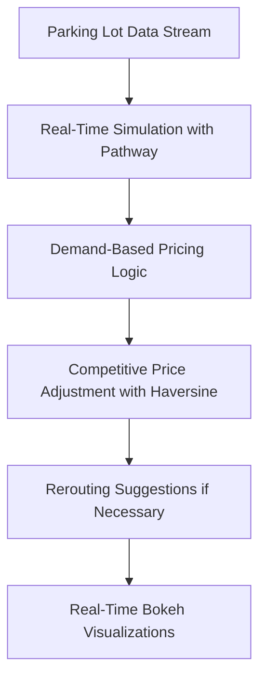

# 🅿️ Urban Parking Real-Time Dynamic Pricing System

## 🚗 Overview

Urban parking spaces are a scarce, high-demand commodity. This project simulates a **real-time dynamic pricing engine** for 14 urban parking lots based on:

- Historical usage
- Queue lengths
- Nearby traffic
- Special days (e.g., events, holidays)
- Vehicle type
- Competitor pricing and location

Prices are computed in real time via a streaming data pipeline, enabling smart, demand-sensitive pricing and rerouting suggestions.

---

## 🧰 Tech Stack

| Layer          | Tools Used                  |
|----------------|-----------------------------|
| Language       | Python                      |
| Real-time Engine | [Pathway](https://pathway.com)          |
| Visualization  | Bokeh                       |
| Data Handling  | Pandas, NumPy               |
| Geospatial     | Haversine Formula           |
| Environment    | Google Colab / Jupyter      |
| Documentation  | Markdown, Mermaid           |

---

## 🏗️ System Architecture

<!-- Generated with [Mermaid Live Editor](https://mermaid-js.github.io/mermaid-live-editor)-->

**Workflow Summary:**

* Real-time parking data enters via a simulated stream
* Prices adjust based on demand, occupancy, and traffic
* Competitor pricing and proximity assessed with Numpy Haversine
* If lots are full or overpriced, rerouting suggestions provided
* Price trends visualized live using Bokeh

🧠 Pricing Models
Model	Description
Model 1	Linear price increase based on occupancy.
Model 2	Demand function combining occupancy, queue length, traffic, vehicle type, and special day.
Model 3	Adds competitor awareness: uses distance between garages and rerouting logic.

Each model starts from a base price of $10 and adjusts within the bounds of $5 to $20.

🗺️ Rerouting Logic (Model 3)
Each lot identifies nearby competitors via latitude/longitude (within 1km).

If full and cheaper nearby options exist → suggest rerouting and reduce price.

If nearby lots are more expensive → allow a price increase.

📊 Visualizations
14 garages × 3 models = 42 interactive Bokeh plots

Each shows real-time price progression for a garage under a specific model

Can be visualized inside Jupyter/Colab directly

📂 Repository Structure
bash
Copy
Edit
urban-parking-dynamic-pricing/
│
├── dataset.csv                  # Input data with 14 garages × 73 days × 18 time points
├── Final_Dynamic_Pricing_Notebook.ipynb  # Main Colab-ready notebook
├── README.md                    # This file
└── architecture.png             # Optional exported Mermaid image (if used)
📌 Dependencies
Install dependencies in your environment (or Colab):

bash
Copy
Edit
pip install pathway pandas numpy bokeh
📖 References
Pathway Docs

Summer Analytics 2025 Problem Statement

Mermaid Live Editor

